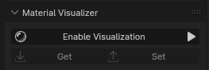
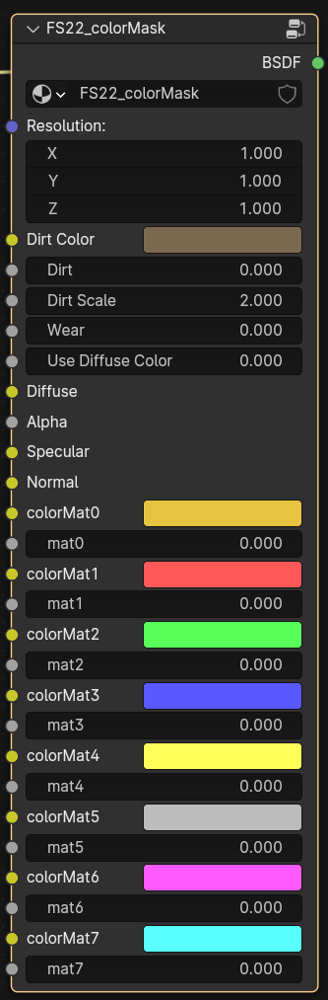
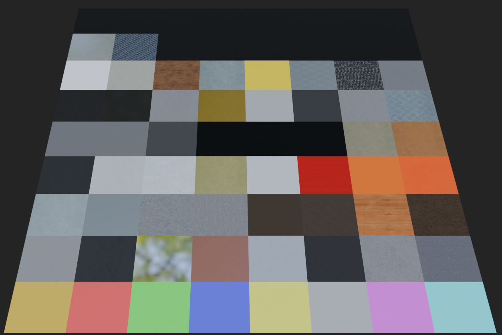

# Giants Material Visualizer

  <a href="https://github.com/StjerneIdioten/I3D-Blender-Addon/releases/latest/download/i3d_exporter.zip">Download Newest Release</a> •
  <a href="https://github.com/StjerneIdioten/I3D-Blender-Addon/releases">All Releases</a> •

## Description

A Blender addon for visualizing materials in the I3D format used by the Giants Engine. The addon is designed to be a tool for modders to easily visualize and tweak materials in Blender, and then export them to the I3D format.
Big thanks to [FSG Modding](https://github.com/FSGModding/Blender_FS22_UDIM_Visualization) for the idea and some shader nodes, that are used in this project.

## Installation

Installation of the addon is done by downloading the latest release from the [releases page](https://github.com/FS-Community-Tools/Giants-Material-Visualizer/releases) and installing it in Blender. The installation process is as follows:

1. Download [Latest Release](https://github.com/FS-Community-Tools/Giants-Material-Visualizer/releases/download/0.9.0/giants_material_vis.zip)
2. Open Blender
3. Go to `Edit` -> `Preferences` -> `Add-ons` -> `Install...`
4. Select the downloaded zip file and click `Install Add-on`
5. Enable the addon by checking the box next to `Giants Material Visualizer` in the list of addons
6. Click `Save Preferences` to save the changes
7. The addon is now installed and ready to use

## Usage

Addon does not break the material setting for the export, so even visualized materials can be exported without any issues.
For the models that do not have prepared textures, scale of material needs to be manually set in the `Shader -> Resolution -> Z` panel.
Scale should be calculated as 'max(width, height) / 256' where width and height are the resolution of the texture.

### In case of manually plugging the textures, the user needs to set the resolution manually or just enable and disable material visualization.

The addon is designed to be as user-friendly as possible, and the usage is as follows:

1. Go to the `Material` tab in the `Properties` panel
2. Select the material you want to visualize
3. Click the `Enable Visualization` button in the `Material Visualizer` panel

### Shader Parameters

|       Parameter       | Description                                                                        |
|:---------------------:|------------------------------------------------------------------------------------|
|    **Resolution**     | Used by script. X/Y - Width / Height of image, Z - scale of the shader material    |
|    **Dirt Color**     | Color of the dirt, same as in Giants Shader                                        |
|       **Dirt**        | Control of the dirt                                                                |
|    **Dirt Scale**     | Scale of the dirt, used by script, but can be adjusted                             |
|       **Wear**        | Control of the wear                                                                |
| **Use Diffuse Color** | If enabled, overlays material color with diffuse color. Used by Decals             |
|      **Diffuse**      | Diffuse image input - controlled by script                                         |
|       **Alpha**       | Alpha image input - controlled by script                                           |
|     **Specular**      | Specular / Vmask image input - controlled by script                                |
|      **Normal**       | Normal image input (color input, not vector) - controlled by script                |
|     **colorMatX**     | Color of user material where X means UV position. Same as in Giants Editor         |
|       **matX**        | Material type of user material where X means UV position. Same as in Giants Editor |

For now, all the features support just [Community I3D Exporter](https://github.com/StjerneIdioten/I3D-Blender-Addon)

#### All the features works just when the shader is selected and shader type contains `colorMask`.

- **Real Time Update** - Updates the shader values _**in real time**_ that will be exported (Visualizer Parameters -> Shader Parameters)
- **Get** - Updates the shader values that will be exported (Visualizer Parameters -> Shader Parameters)
- **Set** - Updates the visualizer values from the shader (Shader Parameters -> Visualizer Parameters)

## Known Issues

When the shader is first time imported, user needs to click twice to enable Visualization (this happens just in case when shader was not already imported in the scene).
It is caused by handler that is triggered before the material is constructed.

## What's Next

- Add support for official Giants I3D Exporter
- Add UDIM picker

## Help

If you need help with the addon in any way, the following channels are available:

* [Issue Tracker](https://github.com/FS-Community-Tools/Giants-Material-Visualizer/issues): If you come across any bugs, please post them here.
* [AgroSketch Discord](https://discord.gg/Qb6hq5z): Tag me in the #modding channel @lkaminco
* [VertexDezign Discord](https://discord.com/invite/vertexdezign): Tag me in the #modding channel @lkaminco